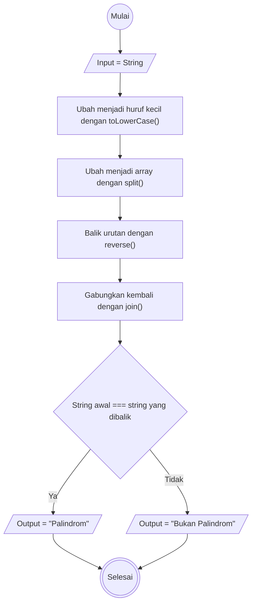
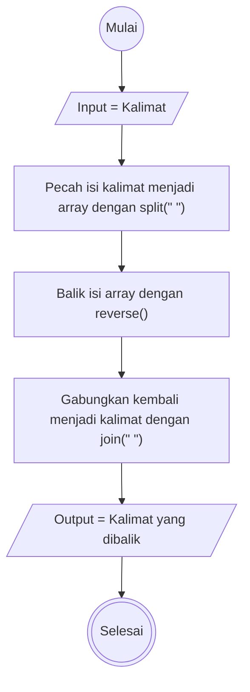

# Weekly Task 1 

## Deteksi Palindrom

**Algoritma**

1. Mulai
2. Masukkan string (kata) yang ingin dicek
3. Ubah string menjadi huruf kecil menggunakan method toLowerCase
4. Ubah string menjadi array menggunakan method split
5. Balik urutan array dengan method reverse
6. Gabungkan array yang sudah dibalik menjadi string kembali dengan method join
7. Jika string awal sama dengan string yang dibalik, tampilkan "Palindrom"
8. Jika tidak sama, tampilkan "Bukan Palindrom"
9. Selesai

**Flowchart**

## Reverse Words

**Algoritma**

1. Mulai
2. Masukkan kalimat yang urutannya ingin dibalik
3. Pecah isi kalimat ke dalam array dengan method split
4. Balik urutan isi array dengan method reverse
5. Gabungkan isi array menjadi satu kalimat kembali dengan method join
6. Tampilkan hasil kalimat yang sudah dibalik urutannya
7. Selesai

**Flowchart**

