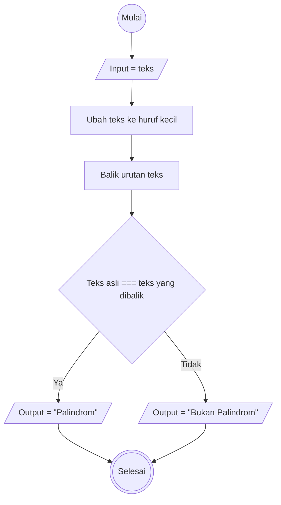
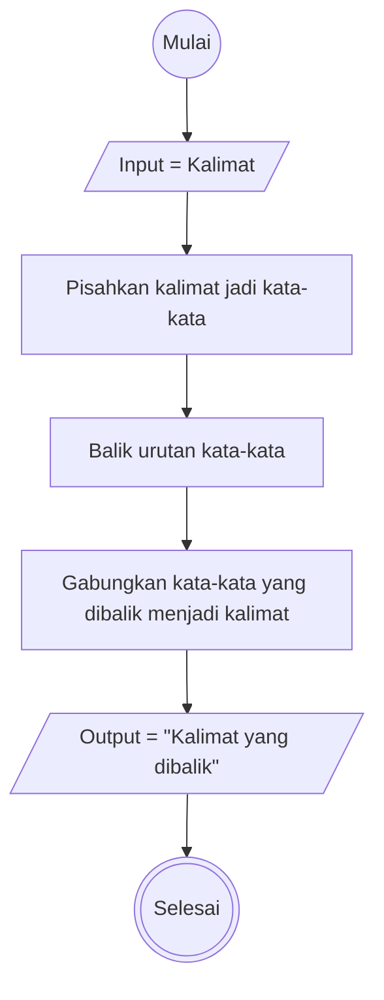

# Weekly Task 1 

## Deteksi Palindrom

**Algoritma**

1. Mulai
2. Masukkan teks yang ingin dicek
3. Ubah semua huruf menjadi huruf kecil (supaya tidak sensitif huruf besar/kecil)
4. Balik urutan huruf dari teks tersebut
5. Bandingkan teks asli dan teks yang sudah dibalik
6. Jika sama, tampilkan "Palindrom"
7. Jika tidak sama, tampilkan "Bukan Palindrom"
8. Selesai

**Flowchart**

## Reverse Words

**Algoritma**

1. Mulai
2. Masukkan kalimat yang ingin dibalik urutan kata-katanya
3. Pisahkan kalimat menjadi kata-kata 
4. Balik urutan kata-kata tersebut
5. Gabungkan kembali kata-kata yang sudah dibalik menjadi satu kalimat
6. Tampilkan hasil kalimat yang sudah dibalik urutannya
7. Selesai

**Flowchart**

